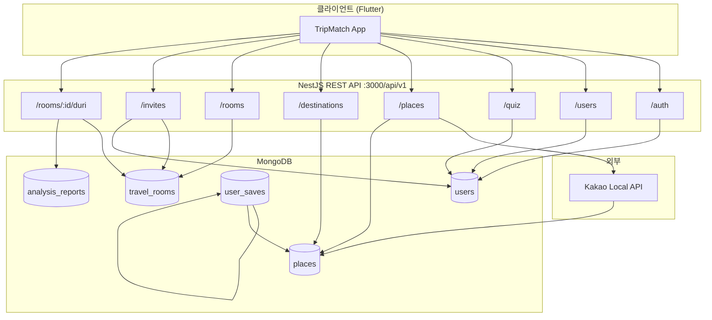
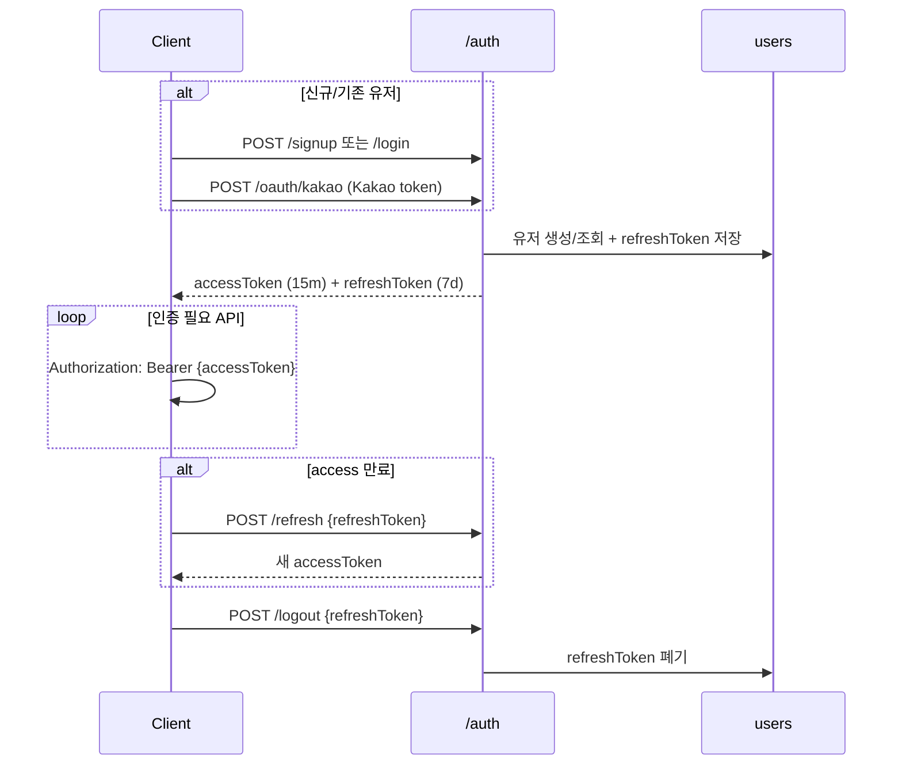
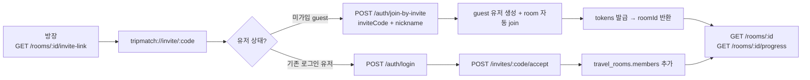
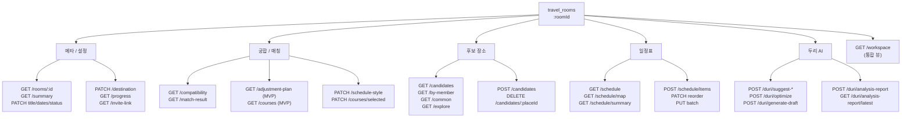
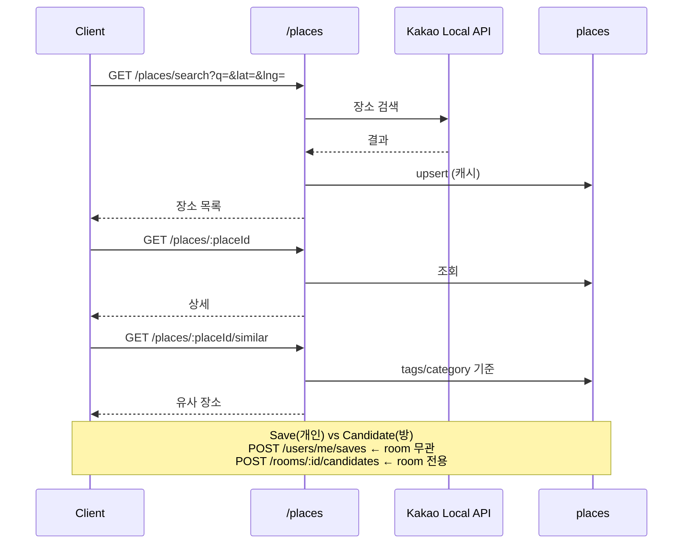

# Tourmate 백엔드 API 흐름도

> Base URL: `http://localhost:3000/api/v1`  
> 상세 API 목록: [`BACKEND.md`](./BACKEND.md) · Swagger: http://localhost:3000/api/docs

---

## 1. 시스템 전체 구조



### MongoDB 컬렉션

| 컬렉션 | 저장 내용 |
|--------|-----------|
| `users` | email, oauth, nickname, travelType, quizAnswers, onboardingCompleted, isGuest, refreshTokens |
| `travel_rooms` | title, destination, dates, status, members, inviteCode, candidatePlaces, schedule, scheduleStyle |
| `places` | 장소 (Kakao cache + manual seed), tags, popularityScore |
| `user_saves` | 유저 개인 Save (placeId, optional roomId) |
| `analysis_reports` | 두리 분석 리포트 (route, budget, density 등) |

---

## 2. JWT 인증 흐름

모든 인증 API의 전제가 되는 토큰 흐름입니다.



| 토큰 | 만료 (기본) | 용도 |
|------|-------------|------|
| accessToken | 15m | API 호출 |
| refreshToken | 7d | access 갱신 (DB 최대 5개 저장) |

### 인증 필요 여부

| 구분 | Bearer 필요 |
|------|-------------|
| 공개 | `/auth/signup`, `/login`, `/refresh`, `/oauth/kakao`, `/join-by-invite`, `/quiz/questions`, `/places/*`, `/destinations/*` |
| 인증 필수 | 그 외 전부 |

---

## 3. 메인 MVP 사용자 여정 (Happy Path)

앱의 핵심 플로우를 API 호출 순서로 표현한 다이어그램입니다.

```mermaid
flowchart TD
    START([앱 시작]) --> AUTH

    subgraph Phase1["① 계정 & 온보딩"]
        AUTH["POST /auth/signup<br/>POST /auth/login<br/>POST /auth/oauth/kakao"]
        AUTH --> QUIZ_Q["GET /quiz/questions"]
        QUIZ_Q --> QUIZ_S["POST /quiz/submit"]
        QUIZ_S --> TRAVEL_TYPE["TravelType 저장 → users"]
        TRAVEL_TYPE --> ONBOARD["PATCH /users/me/onboarding-complete"]
    end

    subgraph Phase2["② 홈 & 탐색"]
        ONBOARD --> HOME["GET /users/me<br/>GET /destinations/popular"]
        HOME --> EXPLORE["GET /places/search<br/>GET /places/:id"]
        EXPLORE --> SAVE["POST /users/me/saves<br/>(개인 저장, room과 분리)"]
    end

    subgraph Phase3["③ 여행방 생성"]
        SAVE --> CREATE["POST /rooms"]
        CREATE --> SETUP["PATCH /rooms/:id/destination<br/>PATCH /rooms/:id (dates, title)"]
        SETUP --> INVITE["GET /rooms/:id/invite-link<br/>POST /rooms/:id/invites (재발급)"]
    end

    subgraph Phase4["④ 멤버 초대 & 궁합"]
        INVITE --> ACCEPT["POST /invites/:code/accept<br/>(기존 유저)"]
        INVITE --> GUEST["POST /auth/join-by-invite<br/>(guest 입장)"]
        ACCEPT & GUEST --> COMPAT["GET /rooms/:id/compatibility<br/>GET /rooms/:id/match-result"]
        COMPAT --> ADJ["GET /rooms/:id/adjustment-plan (MVP)<br/>GET /rooms/:id/courses (MVP)"]
        ADJ --> STYLE["PATCH /rooms/:id/schedule-style<br/>PATCH /rooms/:id/courses/selected"]
    end

    subgraph Phase5["⑤ 후보 & 일정"]
        STYLE --> CAND["POST /rooms/:id/candidates<br/>GET /rooms/:id/candidates/common"]
        CAND --> SCHED["POST /rooms/:id/schedule/items<br/>PATCH reorder / PUT batch"]
        SCHED --> WS["GET /rooms/:id/workspace<br/>(room + candidates + schedule 한번에)"]
    end

    subgraph Phase6["⑥ 두리 AI (MVP stub)"]
        WS --> DURI["POST /rooms/:id/duri/*<br/>suggest-places, optimize, generate-draft..."]
        DURI --> REPORT["POST /duri/analysis-report<br/>GET /duri/analysis-report/latest"]
    end

    REPORT --> DONE([여행 완료<br/>PATCH /rooms/:id status=completed])
```



### 텍스트 요약

```
회원가입/로그인
    ↓
GET /quiz/questions → POST /quiz/submit (TravelType)
    ↓
POST /rooms (여행방 생성)
    ↓
PATCH destination / dates
    ↓
POST /rooms/:id/candidates (후보 수집)
    ↓
GET /rooms/:id/compatibility (궁합)
    ↓
POST /rooms/:id/schedule/items (일정 작성)
    ↓
POST /rooms/:id/duri/* (두리 제안 — MVP stub)
```

---

## 4. 초대(Guest) vs 기존 유저 분기



---

## 5. 여행방(Room) 내부 API 그룹

하나의 `roomId`를 중심으로 묶이는 API들입니다.



---

## 6. 장소(Places) 데이터 흐름



---

## 7. 모듈별 API 맵

| Phase | 모듈 | Prefix | 핵심 API | DB |
|-------|------|--------|----------|-----|
| 진입 | Auth | `/auth` | signup, login, refresh, oauth/kakao, join-by-invite | users |
| 프로필 | Users | `/users` | me, profile, travel-type, onboarding-complete | users |
| 온보딩 | Quiz | `/quiz` | questions → submit | users |
| 탐색 | Places | `/places` | search, :id, similar | places |
| 탐색 | Destinations | `/destinations` | popular | places |
| 개인 저장 | User Saves | `/users/me/saves` | GET / POST / DELETE | user_saves |
| 여행방 | Rooms | `/rooms` | CRUD, destination, progress, workspace | travel_rooms |
| 협업 | Invites | `/invites` | accept | travel_rooms |
| 매칭 | Rooms (sub) | `/rooms/:id` | compatibility, courses, schedule-style | travel_rooms |
| 일정 | Rooms (sub) | `/rooms/:id` | candidates, schedule items | travel_rooms |
| AI | Duri | `/rooms/:id/duri` | suggest-*, analysis-report | travel_rooms, analysis_reports |

---

## 8. 구현 상태 요약

| 상태 | 의미 |
|------|------|
| **완료** | 실로직 구현됨 |
| **MVP** | API는 있으나 stub / heuristic (프론트 연동용) |
| **시작 전** | 미구현 (Phase 2/3) |

### MVP (stub/heuristic)

- `GET /rooms/:id/adjustment-plan`
- `GET /rooms/:id/courses`
- `POST /rooms/:id/duri/*` 대부분

### Phase 2 / 3 백로그

| 항목 | Phase |
|------|-------|
| Google / Apple OAuth | 2 |
| guest → 정식 계정 merge | 2 |
| Kakao Directions + 캐싱 | 2 |
| N명 그룹 궁합 알고리즘 | 2 |
| priority must/optional/skip 일정 로직 | 2 |
| LLM 기반 두리 | 3 |
| WebSocket 실시간 협업 | 3 |

---

## 관련 문서

- [`BACKEND.md`](./BACKEND.md) — 전체 API 인벤토리
- [`DISCUSSION_CHECKLIST.md`](./DISCUSSION_CHECKLIST.md) — 미확정 product 질문
- [`README.md`](./README.md) — 로컬 실행 가이드
